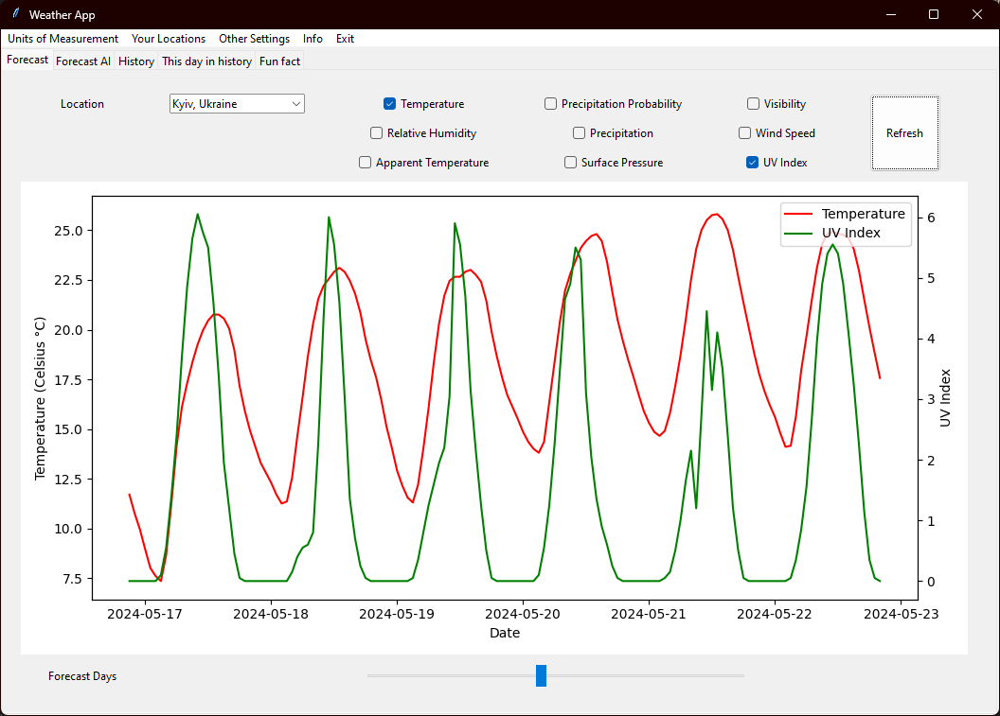
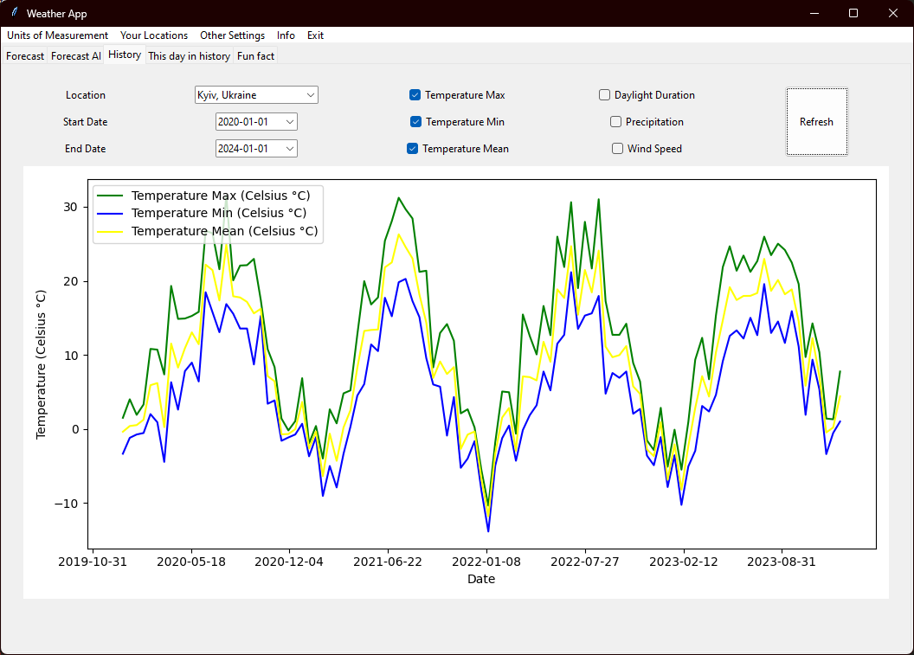
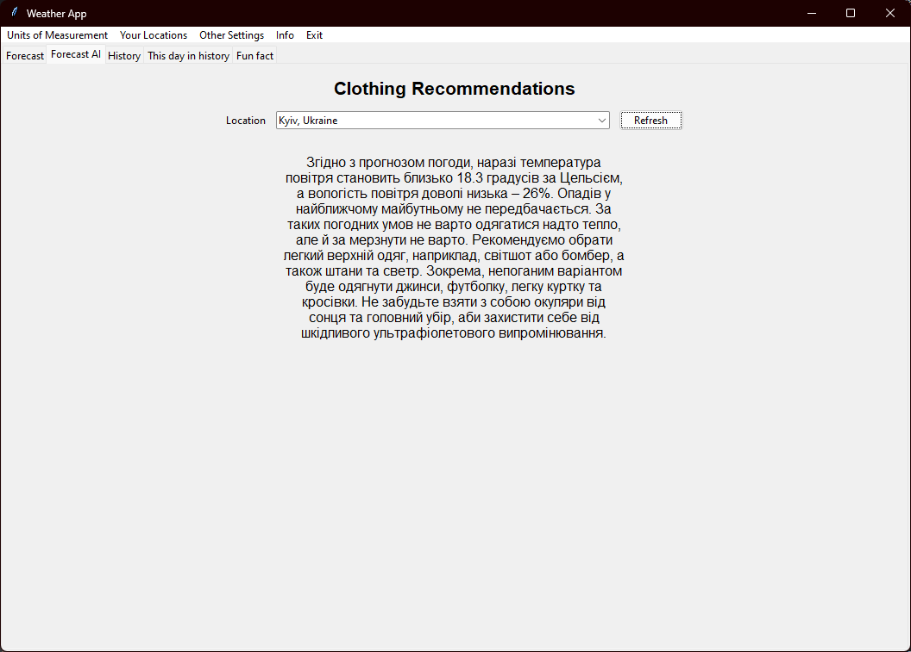

# Додаток для погоди Nebokrug

## Огляд

Nebokrug - це всебічний додаток для погоди, створений за допомогою Python та API Open-Meteo. Цей додаток пропонує різноманітні функції, включаючи прогнози погоди, історичні дані про погоду, рекомендації щодо одягу на основі штучного інтелекту та цікаві щоденні факти про погоду. Цей проєкт служить як хобі та курсовою роботою.

## Особливості

- **Прогноз погоди:** Отримуйте детальні прогнози погоди на найближчі дні.
- **Історичні дані про погоду:** Переглядайте історію погоди за вибраний день у попередні роки.
- **Рекомендації щодо одягу на основі штучного інтелекту:** Отримуйте поради щодо того, що вдягнути, на основі поточних та прогнозованих погодних умов.
- **Щоденні факти про погоду:** Дізнавайтесь цікаві факти про погоду на вибраний день.

## Встановлення

Щоб почати роботу з Nebokrug, виконайте наступні кроки:

1. **Клонуйте репозиторій:**

```sh
git clone https://github.com/Misha1tigr/NeboKrug.git
```

2. **Перейдіть до директорії проекту:**

```sh
cd NeboKrug
```

3. **Встановіть необхідні пакети:**

```sh
pip install -r requirements.txt
```

4. **Запустіть додаток:**

```sh
python main.py
```

## Використання

1. **Прогноз погоди:** Виберіть місто та дату для перегляду прогнозу погоди.
2. **Історичні дані про погоду:** Виберіть дату, щоб побачити історичні дані про погоду за цей день у попередні роки.
3. **Рекомендації щодо одягу:** Отримуйте поради на основі штучного інтелекту щодо того, що вдягнути.
4. **Щоденні факти про погоду:** Дізнавайтеся цікаві факти про погоду на цей день.

## Внесок

Я вітаю внески для покращення Nebokrug. Якщо у вас є пропозиції щодо поліпшень або нових функцій, будь ласка, створіть pull request або відкрийте issue для обговорення.

## Автор

- **Ім'я:** Михайло Корбут
- **Електронна пошта:** korbutmykhailo@gmail.com

## Ліцензія

Цей проект ліцензований за ліцензією MIT. Дивіться файл `LICENSE` для деталей.

## Знімки екрану





## Подяки

- **API Open-Meteo** за надання даних про погоду.
- **Tkinter** за фреймворк GUI.
- **Matplotlib** за графічне відображення історичних та прогнозованих даних.

## Майбутні можливості

- **Покращені рекомендації на основі штучного інтелекту:** Більш детальні рекомендації щодо одягу та активностей.
- **Локалізовані погодні попередження:** Сповіщення в реальному часі про суворі погодні умови.
- **Профілі користувачів:** Збереження налаштувань користувачів та місць для швидкого доступу.
- **Більше цікавих фактів:** Розширена база даних цікавих фактів про погоду.

Ви можете досліджувати код, використовувати його як є або налаштовувати під свої потреби. Ваші відгуки та внески дуже цінуються.